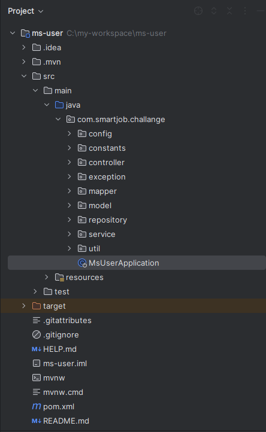
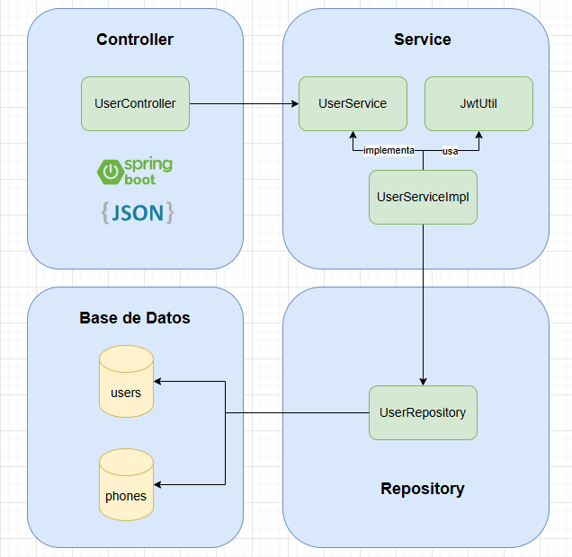

# 📚 Registro de Usuario

## Descripción del Proyecto

El proyecto **Registro de usuario** es un microservicio diseñada registrar usuarios y generar un token JWT.

---

## 🛠️ Tecnologías Utilizadas

- **Lenguaje:** Java 17
- **Framework:** Spring Boot 3.2.11
- **Base de Datos:** H2 (base de datos en memoria)
- **ORM:** Spring Data JPA
- **Librerías:** Lombok para reducir el código boilerplate
- **Gestor de Dependencias:** Maven
- **Swagger:** SpringDoc OpenAPI
- **Editor Recomendado:** IntelliJ IDEA

---

## ✨ Características Principales

1. **Registro de Usuarios:** Endpoint para registrar nuevos usuarios con validaciones y manejo de errores.

2. **Validaciones Personalizadas:** Validación de correo electrónico y contraseña mediante expresiones regulares configurables, y campos requeridos.

3. **Manejo de Errores:** Todos los errores retornan en formato JSON con mensajes claros.

4. **Generación de Token JWT:** Al registrar un usuario, se genera y persiste un token JWT.

5. **Base de Datos en Memoria:** Utiliza H2 para facilitar las pruebas y el desarrollo.

6. **Documentación con Swagger:** La API está documentada y puede ser probada mediante Swagger UI.

7. **Pruebas Unitarias:** Cobertura completa de código utilizando JUnit y Mockito.


---

## 🚀 Pasos para Ejecutar el Proyecto

#### **Requisitos Previos**
- **Java JDK 17** instalado.
- **Maven** instalado.

#### **Instrucciones**

1. **Clona el repositorio:**
   ```bash
   git clone https://github.com/YoelPatricio/ms-user.git
   cd ms-user

2. **Instalar dependencias:**

   ```bash
   mvn clean install

3. **Compila y ejecuta el backend:**

   ```bash
   mvn spring-boot:run

4. **Accede a la consola H2 (base de datos en memoria):**

   - **URL:** [http://localhost:8080/h2-console](http://localhost:8080/h2-console)
   - **Configuración:**
     - **URL JDBC:** `jdbc:h2:mem:testdb`
     - **Usuario:** `sa`
     - **Contraseña:** *(dejar en blanco)*

5. **Accede a la documentación Swagger:**

   - **URL:** [http://localhost:8080/swagger-ui/index.html](http://localhost:8080/swagger-ui/index.html)

**NOTA:** Se adjunta scripts para la creacion de las tablas (src/main/resources/db/scripts.sql)

### **Endpoints**
- **Usuarios:**
  - `POST /api/users/register`: Registrar un usuario.

---

## 📁 Estructura del Proyecto




## 📸 Documentacion Swagger


## 📸 Diseño de la solución



